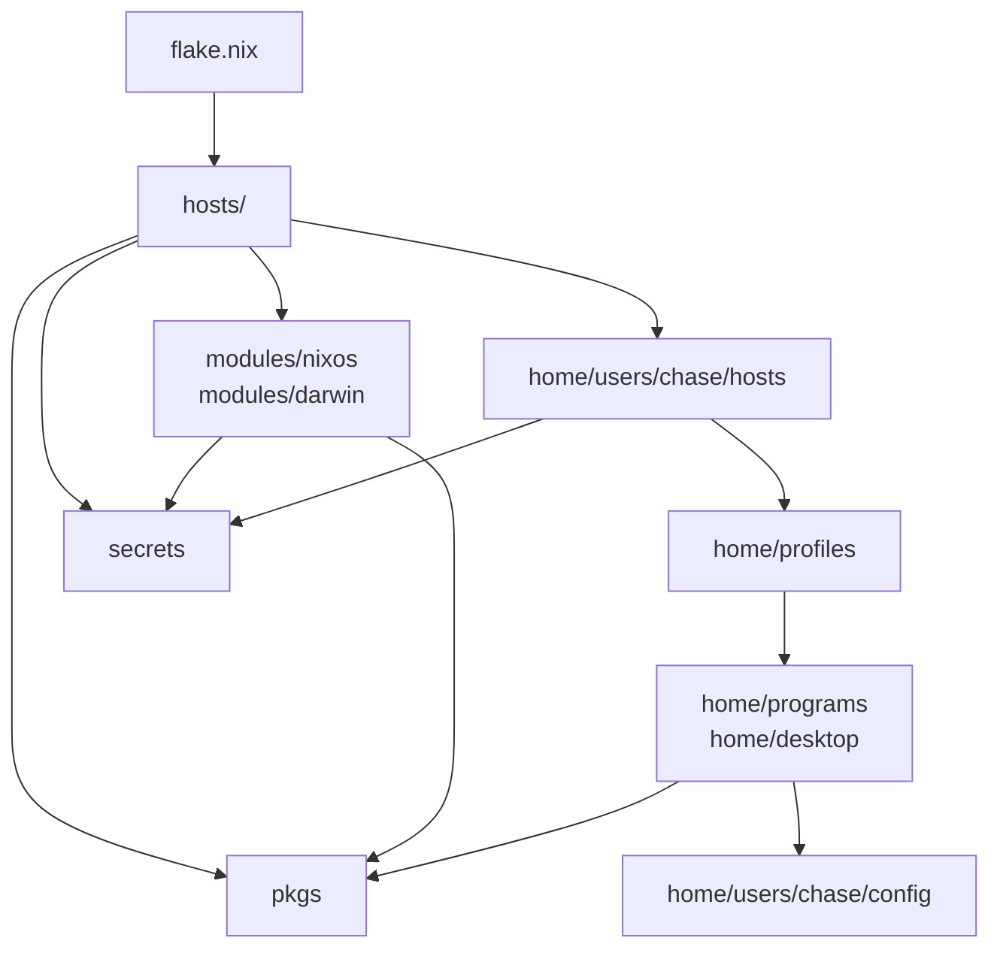

# Nix Configuration Agent Instructions

Optimize for clarity, composability, and reversibility. Every change should be easy to understand, easy to disable, and safe to evolve.

# Nix repo layer rules

This document defines the intended layer rules for the repo reorg. It is a guide for how files should be arranged and imported, not a claim that every file already matches this shape.

## Diagram



Imports should flow downward. Higher layers compose lower layers. Lower layers should not import host files, user host files, or profiles above them.

## Layers

### `flake.nix`

Top level output wiring. It should pin inputs, expose systems, and point at host entry points such as `hosts/pc/default.nix`, `hosts/macbook/default.nix`, and `hosts/macbook-vm/default.nix`.

Rules:

- May point to `hosts/<host>`.
- Should pass shared inputs through `specialArgs` or output wiring.
- Should not hold host service config or raw app config.

### `hosts/<host>`

Machine composition. Existing examples include `hosts/pc/default.nix`, `hosts/pc/hardware-configuration.nix`, `hosts/macbook/default.nix`, `hosts/macbook-vm/default.nix`, and `hosts/macbook-vm/orbstack.nix`.

Rules:

- May import `modules/nixos` or `modules/darwin`.
- May import `home/users/chase/hosts/<host>` once that layer exists.
- May choose host specific packages and secrets.
- Should not define reusable Home Manager program behavior inline.

### `modules/{nixos,darwin}`

Reusable OS modules. Current examples include `modules/nixos/base.nix`, `modules/nixos/docker.nix`, `modules/nixos/greetd.nix`, `modules/nixos/nvidia.nix`, `modules/darwin/base.nix`, and `modules/darwin/homebrew.nix`.

Rules:

- May define system services, platform defaults, and OS packages.
- May use `pkgs` for custom packages.
- May use secrets only through explicit option or secret module plumbing.
- Should not import `hosts/<host>`, `home/users/chase/hosts`, or `home/profiles`.

### `home/users/chase/hosts`

User per host composition. Current files include `home/users/chase/hosts/pc.nix`, `home/users/chase/hosts/macbook.nix`, and `home/users/chase/hosts/macbook-vm.nix`.

Rules:

- May import `home/profiles`.
- May bind host specific paths, app settings, and user secrets.
- May pass raw config paths from `home/users/chase/config` into lower modules through options.
- Should not define general program behavior inline.

### `home/profiles`

Reusable Home Manager bundles. This intended layer can group development, desktop, terminal, platform, or similar user modes once they are extracted.

Rules:

- May import `home/programs` and `home/desktop`.
- May expose options for host layers to fill.
- Should not import `hosts/<host>` or `home/users/chase/hosts`.
- Should avoid direct raw config reads unless the profile owns that contract.

### `home/programs` and `home/desktop`

Reusable Home Manager feature modules. Current examples include `home/programs/git.nix`, `home/programs/zsh.nix`, `home/programs/ghostty.nix`, `home/programs/opencode.nix`, `home/programs/solana.nix`, `home/desktop/hyprland/default.nix`, `home/desktop/hyprland/keybindings.nix`, and `home/desktop/hyprland/windowrules.nix`.

Rules:

- Configure one program or desktop feature area.
- May define reusable options for profiles or user host layers.
- May use `pkgs` for package choices.
- Should receive raw app config by path option.
- Should not import host files, profiles, or user host composition.

Raw app config should be passed by path options. For example, a user host layer can set `my.program.configFile = ../config/oh-my-openagent.jsonc;`, while the program module only consumes `configFile`. This keeps modules reusable and protects local files such as `home/users/chase/config/oh-my-openagent.jsonc` during the reorg.

### `home/users/chase/config`

User owned config and data. This layer is primarily for app native files such as JSON, JSONC, TOML, YAML, scripts, templates, and text config. It can also hold Chase specific data or host override modules when the file is not reusable outside this user, such as `home/users/chase/config/repos.nix` and `home/users/chase/config/hyprland-pc.nix`. `home/users/chase/config/oh-my-openagent.jsonc` is the concrete file to treat carefully and not clobber.

Rules:

- Should not import reusable Nix modules from `home/programs`, `home/profiles`, or `hosts`.
- Should be consumed by path options from user host, profile, or program layers.
- Should remain safe to edit outside the Nix module graph.

### `pkgs`

Custom package definitions. Current examples include `pkgs/solana/solana-cli.nix`, `pkgs/solana/solana-platform-tools.nix`, `pkgs/solana/solana-rust.nix`, and `pkgs/solana/solana-source.nix`.

Rules:

- May be used by hosts, OS modules, profiles, or program modules.
- Should stay package focused.
- Should not know which host or user consumes a package.

### `secrets`

Secret declarations and encrypted material. Current examples include `secrets/secrets.nix` and the integration module `modules/agenix.nix`.

Rules:

- May be referenced by host, OS, or user host layers when that layer owns the choice.
- Reusable modules should receive secret names or paths through options when possible.
- Never hardcode decrypted secret values in Nix modules or raw config files.

## Import direction

Preferred direction:

1. `flake.nix`
2. `hosts/<host>`
3. `modules/{nixos,darwin}` and `home/users/chase/hosts`
4. `home/profiles`
5. `home/programs` and `home/desktop`
6. `home/users/chase/config`
7. `pkgs` and `secrets` as shared support layers

Good:

```nix
# User host layer chooses the raw config path.
my.program.configFile = ../config/oh-my-openagent.jsonc;
```

```nix
# Profile composes reusable modules.
imports = [
  ../programs/git.nix
  ../programs/zsh.nix
];
```

Avoid:

```nix
# Program module reaches into user host composition.
imports = [ ../../users/chase/pc.nix ];
```

```nix
# Raw config is embedded in a reusable module.
xdg.configFile."app/config.jsonc".text = ''
  { "hostSpecific": true }
'';
```

## Reorg invariants

- Preserve existing host behavior while extracting layers.
- Write docs only until a reorg step explicitly edits Nix code.
- Keep dirty local raw config, especially `home/users/chase/config/oh-my-openagent.jsonc`, untouched unless the user asks for that file to change.
- Move reusable logic down. Keep machine and user host choices up.
- Pass raw app config by path options instead of direct cross layer reads.
- Keep `pkgs` free of host and user assumptions.
- Keep secret selection explicit in host or user host composition.
- Treat any upward import as a temporary violation to document or fix in the same reorg slice.
