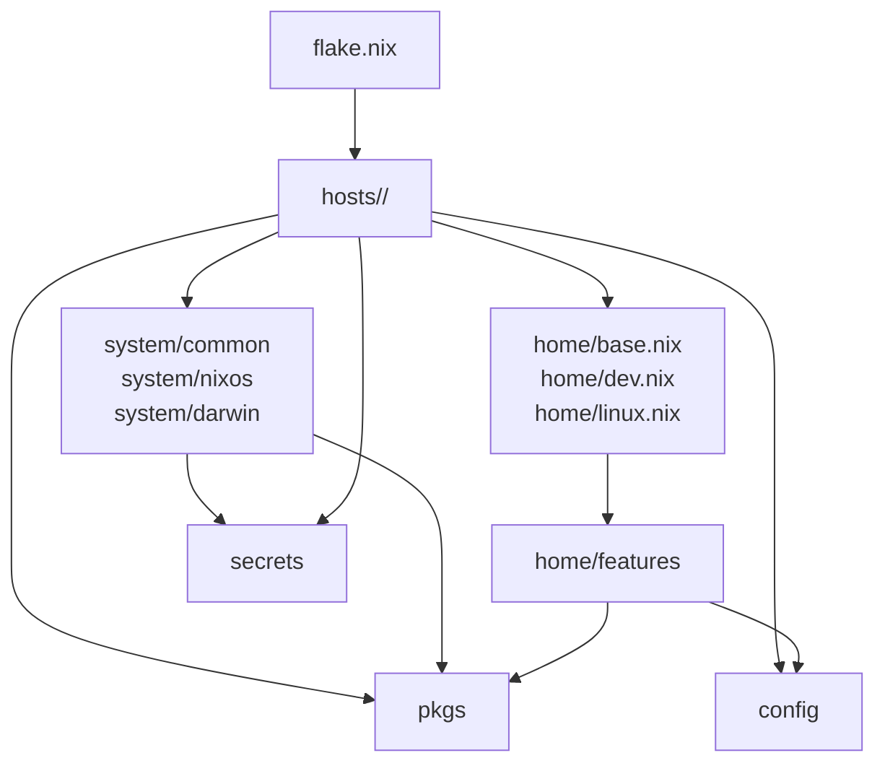

# Nix Configuration Agent Instructions

Optimize for clarity, composability, and reversibility. Every change should be easy to understand, easy to disable, and safe to evolve.

# Nix repo layer rules

The repo is intentionally shallow: hosts own host choices, `system/` owns reusable system modules, `home/` owns reusable Home Manager composition, and `config/` owns native app config files.

## Diagram



Imports should flow downward. Higher layers compose lower layers. Lower layers should not import host files or host-specific app config.

## Layers

### `flake.nix`

Top-level output wiring. It pins inputs, defines shared host/user metadata, exposes NixOS/Darwin systems, and points each host at both its system module and Home Manager module.

Rules:

- May point to `hosts/<host>/default.nix` and `hosts/<host>/home.nix`.
- May construct shared `local.user` / `local.host` data.
- Should pass shared inputs through `specialArgs` or output wiring.
- Should not hold host service config or raw app config.

### `hosts/<host>`

Machine composition. Each host keeps system and user-host choices together:

- `hosts/<host>/default.nix` — system-level NixOS/nix-darwin config.
- `hosts/<host>/home.nix` — host-specific Home Manager config.
- Additional host-owned files like `hardware-configuration.nix` or `orbstack.nix` live beside them.

Rules:

- May import `system/nixos` or `system/darwin` from `default.nix`.
- May import `home/base.nix`, `home/dev.nix`, `home/linux.nix`, and `home/features/*` from `home.nix`.
- May choose host-specific packages, app config paths, and secret consumers.
- Should not define reusable Home Manager program behavior inline when it belongs in `home/features`.

### `system`

Reusable system modules:

- `system/common/local.nix` defines the shared `local.user` and `local.host` option contract.
- `system/nixos/*` contains reusable NixOS modules, including `system/nixos/agenix.nix`.
- `system/darwin/*` contains reusable nix-darwin modules.

Rules:

- May define system services, platform defaults, users, and OS packages.
- May use `pkgs` for custom packages.
- May use secrets through explicit option or secret module plumbing.
- Should not import `hosts/<host>` or `home/*` composition files.

### `home/{base,dev,linux}.nix`

Small reusable Home Manager bundles:

- `home/base.nix` — cross-platform shell, git, SSH, keys, and common CLI behavior.
- `home/dev.nix` — development tooling.
- `home/linux.nix` — Linux user defaults and Linux-only integrations.

Rules:

- May import `home/features/*`.
- May expose or fill shared user-level options.
- Should not import `hosts/<host>`.
- Should only read files from `config/` when the bundle owns that user-level contract.

### `home/features`

Reusable Home Manager feature modules. Examples include `home/features/git.nix`, `home/features/zsh.nix`, `home/features/zed.nix`, and `home/features/hyprland/default.nix`.

Rules:

- Configure one program or desktop feature area.
- May define reusable options for host home modules or bundles.
- May use `pkgs` for package choices.
- Should receive raw app config by path option.
- Should not import host files or host composition.

### `config`

Native app config and user-owned data: JSON, TOML, Nix data modules, templates, snippets, and app-specific text files.

Rules:

- Should not import reusable modules from `home/`, `hosts/`, or `system/`.
- Should be consumed by path options from host home modules or reusable Home Manager modules.
- Should remain safe to edit outside the Nix module graph.

### `pkgs`

Custom package definitions.

Rules:

- May be used by hosts, system modules, Home Manager bundles, or Home Manager features.
- Should stay package-focused.
- Should not know which host or user consumes a package.

### `secrets`

Secret declarations and encrypted material.

Rules:

- May be referenced by host or system layers when that layer owns the choice.
- Reusable modules should receive secret names or paths through options when possible.
- Never hardcode decrypted secret values in Nix modules or raw config files.

## Import direction

Preferred direction:

1. `flake.nix`
2. `hosts/<host>/default.nix` and `hosts/<host>/home.nix`
3. `system/{common,nixos,darwin}` and `home/{base,dev,linux}.nix`
4. `home/features`
5. `config`
6. `pkgs` and `secrets` as support layers

Good:

```nix
# Host home layer chooses the raw config path.
custom.zed.settingsPath = ../../config/zed-settings.json;
```

```nix
# Bundle composes reusable modules.
imports = [
  ./features/git.nix
  ./features/zsh.nix
];
```

Avoid:

```nix
# Reusable module reaches into host composition.
imports = [ ../../hosts/pc/home.nix ];
```

```nix
# Raw app config is embedded in a reusable module.
xdg.configFile."app/config.jsonc".text = ''
  { "hostSpecific": true }
'';
```

## Refactor invariants

- Preserve existing host behavior unless the task explicitly asks for behavior changes.
- Keep machine-specific choices in `hosts/<host>`.
- Move reusable logic down into `system/`, `home/{base,dev,linux}.nix`, or `home/features`.
- Pass raw app config by path options instead of direct cross-layer reads.
- Keep `pkgs` free of host and user assumptions.
- Keep secret selection explicit in host or system composition.
- Treat any upward import as a temporary violation to document or fix in the same refactor slice.
